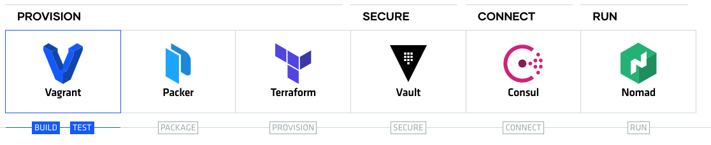

  [](http://hits.dwyl.com/wlwwt/hashi-stack)


<h1>HashiStack</h1> 

<h2> Introduction </h2>

This repository helps with setup of development environment and also of production environment with master nodes and clients. 

- [Development Environment](#Development-Environment) 
- [Enterprise Environment](#Enterprise-Environment) 

## Motivation

 


## Development Environment

Development environment helps to explore tools and test changes using vagrant.
Developpment environment includes:
- Vagrant 
  - Consul 1.7.3
  - Nomad 0.11.1
  - Vault 1.4.1

### Prerequisites

- macOS
- Homebrew
- `brew install packer terraform nomad`
- `brew install --cask virtualbox`


### Usage

```
$ cd vagrant
$ vagrant up
```
## Deployment

Connect nomad cluster and run below command to install job on nomad, please make sure you have enough resources to run the jobs

```
$ vagrant ssh server-1
$ nomad run -address http://172.20.20.11:4646 /tmp/jobs/nginx.nomad
$ nomad run -address http://172.20.20.11:4646 /tmp/jobs/simple.nomad
```

### Access

Use the private IP address to access the applications, in this 

```
Access Nomad Cluster http://172.20.20.11:4646

Access Consul Cluster http://172.20.20.11:8500

Access Vault Cluster http://172.20.20.101:8200

Access Hashi UI http://172.20.20.11:3000
```

## Enterprise Environment

Enterprise environment sets up high availability cluster with 3 masters and 2 clients on AWS.

Environments Includes:
- Packer
- Terraform
  - Nomad
  - Consul
  - Vault

### Prerequsites

- Install Packer and Terraform
- AWS access credentials
- AWS private key

### Usage

setup.sh scripts helps you to setup cluster environment on AWS. Update your AWS credentials in variables.tf and run the script

```
sudo bash setup.sh
```

### Access

With AWS environment we don't have an option to access UI as it's setup with Private IP, but with help of Hashi UI we can access Nomad and Consul

Use the Output of AWS public IP and access hashi UI 

```
Access Hashi UI with http://awspublicip:3000
```